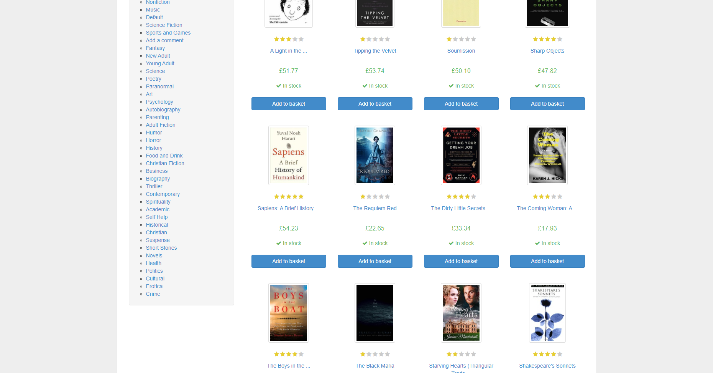
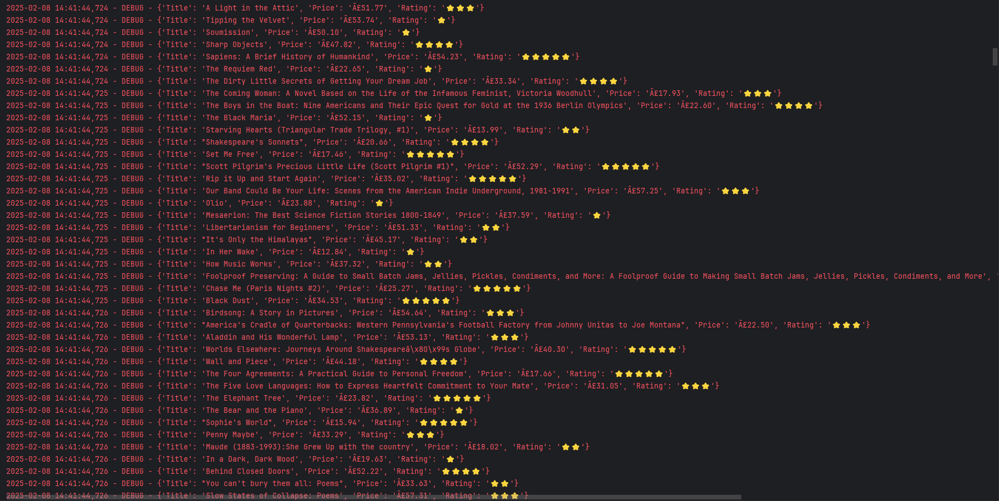

```markdown
# BookHarvest

**BookHarvest** is a comprehensive web scraping project designed to extract book data from the "Books to Scrape" website and export it to a professionally formatted Excel file. The project demonstrates robust techniques for scraping data across paginated pages, converting textual ratings into star emojis, and exporting the results with advanced styling.

---

## Features

- **Data Extraction with Pagination:**  
  Iterates through all available pages on the site to extract book details.

- **Data Fields Scraped:**  
  - **Title:** The name of the book.  
  - **Price:** The price of the book.  
  - **Rating:** The textual rating is converted to star emojis (e.g., "Three" → "⭐⭐⭐").

- **Excel Export with Advanced Formatting:**  
  - Bold, centered headers.
  - All cells are center-aligned.
  - Automatic adjustment of column widths.
  - The "Rating" column is specially formatted with gold-colored stars.

- **Robust and Clean Code:**  
  The code is fully commented in English for clarity and ease of customization.

---

## Installation

1. **Clone the Repository:**

   ```bash
   git clone <repository_url>
   cd BookHarvest
   ```

2. **Create and Activate a Virtual Environment:**

   Using Conda (recommended):
   ```bash
   conda create -n bookharvest_env python=3.9
   conda activate bookharvest_env
   ```
   Or using virtualenv:
   ```bash
   python -m venv bookharvest_env
   # Windows:
   bookharvest_env\Scripts\activate
   # macOS/Linux:
   source bookharvest_env/bin/activate
   ```

3. **Install Required Libraries:**

   ```bash
   pip install requests beautifulsoup4 pandas openpyxl lxml
   ```

---

## Usage

1. **Run the Scraper:**

   Execute the script by running:
   ```bash
   python books_scraper.py
   ```
   This script will:
   - Scrape data from "Books to Scrape" (iterating through all paginated pages).
   - Convert the rating text into star emojis.
   - Print the scraped data to the console.
   - Export the data to an Excel file named `books.xlsx` with advanced formatting.

2. **Check the Output:**

   Open `books.xlsx` to see your data:
   - The header row will be bold and centered.
   - All cells will be center-aligned.
   - Column widths will be auto-adjusted.
   - The "Rating" column will display star emojis in gold color.

---

## Code Overview

The project consists of two main functions:

- **`scrape_books()`**  
  Uses the `requests` library to fetch HTML pages and `BeautifulSoup` to parse and extract book details such as Title, Price, and Rating. It loops through paginated pages until no more data is found.

- **`export_to_excel(data, output_file="books.xlsx")`**  
  Converts the scraped data into a pandas DataFrame and exports it to an Excel file. It then uses `openpyxl` to apply formatting (centered alignment, bold headers, auto-adjusted column widths, and special styling for the "Rating" column).

All key functions are thoroughly commented in English for ease of understanding and future customization.

---

## Customization

- **Pagination Limit:**  
  You can limit the number of pages to scrape by passing a value to the `max_pages` parameter in the `scrape_books()` function.

- **Styling Adjustments:**  
  The Excel export function can be modified to change fonts, colors, and other styling details according to your preference.

- **Data Fields:**  
  You can easily extend the scraper to extract additional data fields by adjusting the BeautifulSoup selectors in the `scrape_books()` function.

---

## License

This project is open-source and available under the [MIT License](LICENSE).

---

## Contact

For any questions or further customizations, please feel free to contact me.

---
## Screenshots

### Books Page


### Log Results


---

*Happy Scraping & Data Harvesting!*
```

---

